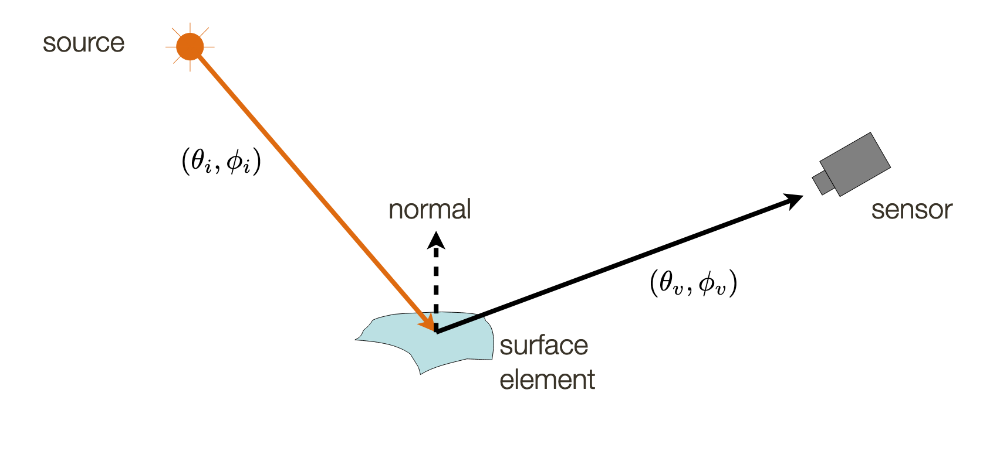
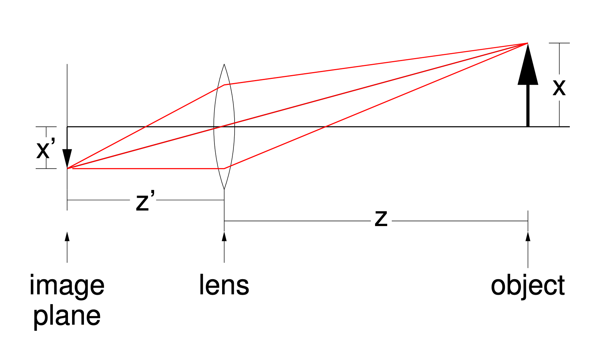

# Lecture 2 - Image Formation

## Goals

* Understand how images are formed
* Develop relevant mathematical concepts and abstractions

## Image Formation

* Sensor (or eye) captures amount of light reflected off the surface
* Reflection depends on both the *viewing* and *illumination* direction
* Amount of light reflected depends on the surface element

## Pinhole

### How it works

### Why not pinhole cameras?

* If pinhole is **too big** then many directions are averaged, blurring the image
* If pinhole is **too small** then diffraction becomes a factor, also blurring the image
* Pinhole cameras are dark because it captures only a small subset of light rays

## Lenses

Reason -> Capture as much light as possible while preserving the features of a pinhole camera.

### Focal length

Incoming parallel rays to a lens converge to a single point at a distance `f` behind the lens.

* `f` is known as focal length
* This is where we want to put the image plane so that the image is in focus
