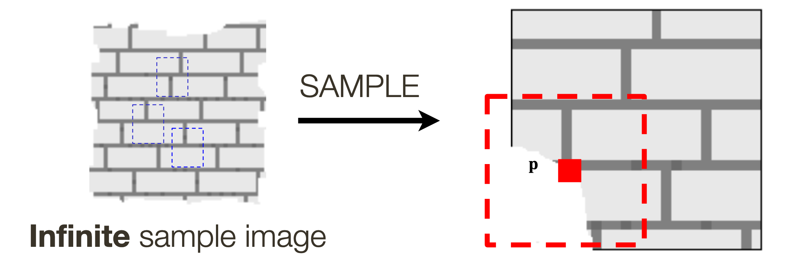

# Lecture 11 - Texture Synthesis and Colour

## Texture Synthesis

**Texture** -> Detail in an image that is at a scale too small to be separated further but at a scall large enough to be apparent in an image.

* Useful for *object identity* if object has a known material
* Useful for *object shape* based on deformation of texture

### Why Generate Textures?

1. Fill holes in images (inpainting)
2. Produce large quantities of textures for computer graphics

### Synthesizing One Pixel

What values can $p$ take?

* Build a probability distribution of possible values of p, given its neighbours
* Pick one value at random

## Colour

