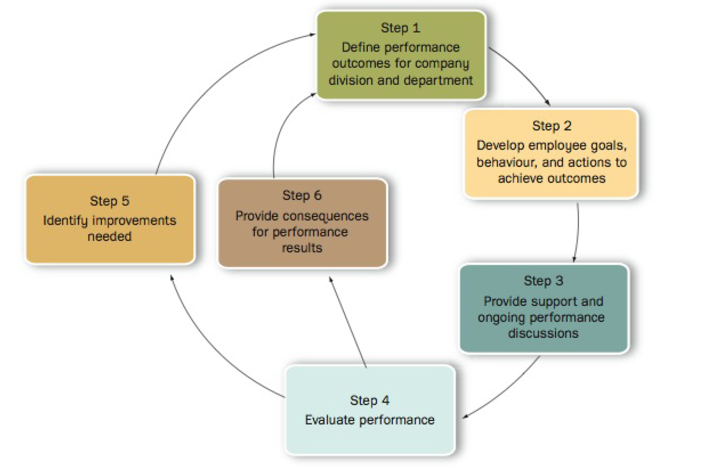

# Managing Employees' Performance

Performance appraisals are crucial as they provide information to all members of an organization about what they need to succeed.

## Performance Management Process

An effective performance management process should contribute to a company's overall competitive advantage.

* **Step 1** and **step 2**: Convert organization goals -> successful employee behaviours
* **Step 3**: Provide support that allows employee to achieve goals
* **Step 4**: Performance appraisals
* **Step 5** and **step 6**: Ongoing feedback on improvements on employee behaviour/actions

## Reasons for Conducting Performance Appraisals

* Strategic purpose
  * Link organization goals -> employee behaviour
  * Communicate goals to employees
  * Good employee performance drives company strategy
* Administrative purpose
  * Provides information on decisions like pay, salary increases, recognition programs, etc.
* Development purpose
  * Basis for developing employee knowledge and skills
  * Feedback on areas employee can improve on

## Criteria for Effective Performance Management

* **Fit with strategy** — Performance management should aim at achieving employee behaviour and mindset that fits with the organization's strategy. 
  * If a company emphasises customer service, then the performance management should emphasise the behaviour that contribute to excellent performance.
	
* **Validity** — Does the performance appraisal measure all relevant aspects of performance?
  * *Contamination* -> irrelevant collected information
  * *Deficiency* -> relevant information that is not considered

* **Reliability** — Describes the consistency of the results that the performance measure will deliver.

* **Acceptability** — The people who use the performance measure must deem it acceptable. If management sees it as time-consuming, they will not use it. Likewise, if employees believe the measure is unfair, they will not use the feedback.

* **Specificity** — A performance measure should specifically tell employees what is expected of them and how they can meet those expectations.

## Performance Appraisal Process

1. Define performance expectations
   1. Create expectations based off job analysis and description
   2. Communicate expectations to employees
2. Appraise performance
3. Provide feedback

## Performance Measurement Methods

**Step 2** in performance appraisal process. Performance is generally measured with regards to one of three options:

* Traits
  * Checks degree to which employees posses specific characteristics
  * May not have correlation to productivity
* Behaviours
  * Emphasizes **how** employees complete tasks
* Results
  * Emphasizes **what** employees complete

Many organizations choose to determine performance through a ==ranking system== where employees are directly compared to each other.

### Ranking

* Simple ranking -> Managers rank each employee from highest-performer to lowest-performer.
* Alternation ranking -> Managers *alternatingly* rank employees; pick highest performer, then lowest performer, then second highest, etc.
* Forced-distribution -> Group certain proportions of employees into a pre-defined set of categories.
  * Good if employees truly have high spread in performance
  * Poor or unfair if employees are generally level
* Paired-comparison -> Compares employees with each other to establish rankings

Ranking is generally *good* because:

* Removes tendency to rank everyone in the "center" of the distribution
* Removes biases caused by a manager being too lenient or too strict
* Useful for making decisions on pay/layoff distribution

Notable drawbacks:

* Difficult to link back to organization goals
* Provides non-specific feedback to employees
* Unfair if employees are **all** high performers

### Traits

* Graphic rating scale
  * List a series of attributes with respective rating scales
  * Manager uses scale to indicate extent in which employee satisfies the attritubes
  * *Low reliability* -> up to manager's discretion as to what defines "outstanding expectations", "meets expectations" etc

Attribute-based performance methods are generally:

* Easy to implement and use -> most popular used method currently
* Can be reliable and valid if careful consideration on what attributes lead to high performance
  * Often not the case
* Difficult to link to strategic goals
* Poor feedback -> employees won't know where or how to improve if they only receive a number in their appraisal

### Behaviours

* Critical incident -> performance measure based on manager's records on employee behaviour that exhibits good/bad performance
  * Specific feedback on employee improvements
  * Inefficient as a comparison metric
* Behaviourally anchored rating scale (BARS) -> scale of behaviour "anchors" that describes what behaviours correlate to what level of performance
  * High validity -> job related behaviours
  * High feedback -> very specific on required behavioural changes
  * Time consuming
  * Requires tailoring for every job

Organizations may implement **organizational behaviour modification** -> plan of behaviour management through a formal system of feedback and reinforcement.

### Results

* Productivity (output)
  * Determine desired outcome -> determine method to measure the outcome -> determine what level of outcome correlates to which level of performance
  * Set up system to track these measures while employees complete tasks
  * Time consuming but has evidently shown to increase productivity
* Management by objectives (MBO)
  * Set goals that "trickle down" -> all employees contribute to goals
  * Goals become basis for performance management
  * Time consuming
  * _Inefficent as a comparison measure_ -> how can an employee be better than another if they contribute to the same final objective?

## Errors in Performance Measurement

### Rating Errors

* **Similar-to-me** -> tendency to give higher evaluation to individuals that are similar to oneself
* **Contrast** -> comparing individuals to other employees rather than to objective standard
  * An employee might seem weaker if colleagues are outstanding, even if said employee performs job up to standard
* **Distribution errors** -> tendency to group employees to a particular part of distribution
  * *Leniency/strictness error* -> tendency to rate individuals too high/too low
  * *Central tendency* -> rate all employees somewhere in the middle
* **Recency emphasis** -> judge solely on most recent work
  * Recent poor performance may undermine exceptional historical performance
* **Focus-on-activities** -> rate based on how busy they *appear*
* **Halo and horns**
  * *Halo* -> rank positively in **all** aspects because employee is exceptional in **one** aspect
  * *Horns* -> opposite of halo
* **Appraisal bias** -> allow external characteristics other than performance to influence rating

### Avoiding Rating Errors

* Train raters on common rating errors
* **Frame of reference training**
  * Identify and eliminate errors based on practice e.g. videos, simulations
  * Effective but costly and time consuming
* **3rd party review** on rating
  * Raters are evaluated on how well they do performance appraisal
  * Feedback is provided on how raters can minimize errors

## Performance Feedback

Ineffective appraisal can undermine employee performance and contribute to poor work motivation/productivity.

### Scheduling Feedback

* Norm is to provide feedback annually
  * Missed improvement opportunity -> if manager notices problem in June, but feedback in November, June -> Nov missed chance to improve
  * Feedback most effective when employee not surprised; employee shouldn't wait for a year to know what their manager thinks of their work

### Preparing Feedback

* Manager should provide *neutral* setting for meeting
* Ask employee to do a self-assessment
  * Potentially provide meaningful discussion if a gap occurs between manager and employee's ratings

### Conducting Feedback

Three approaches:

* **Tell-and-sell** -> management provides ratings then justify ratings
* **Tell-and-listen** -> management provides ratings then allow *employee* to justify those ratings
* **Problem solving** -> management and employee work together to come up with solutions to performance issues

General principles:

* Feedback should paint balanced and accurate picture of employee performance
* Should show specific areas of improvement

## Performance Improvement

Feedback should indicate what employees can do to improve their performance. The "what" is based on what attribute the employee is missing (either motivation or ability).

* **Lack of ability** -> provide training or restructure job to suit their ability.
* **Lack of motivation** -> ensure employee is being treated fairly and rewarded adequately.
  * Sometimes may be as simple as lack of positive reinforcement.
* **Lack of both** -> employee may not be suited for position.

Generally employees with ==high motivation and high ability== perform best.
