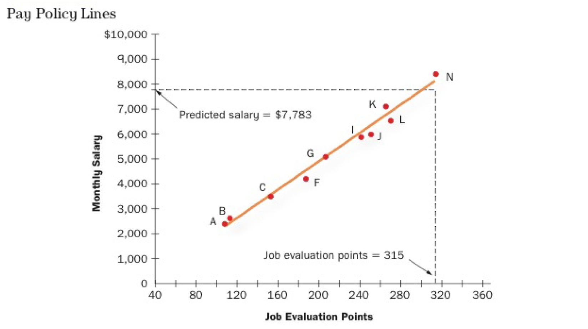

# Total Rewards

## Compensation

*Total compensation* -> All types of financial rewards and tangible benefits an employee receives for their work.
  * Direct -> Financial rewards
  * Indirect -> Benefits and services

### Generational Emphasis

* *Boomers* — High-visibility projects, promotions, personal learning, industry recognition
* *Gen X* — Training, learning and development, challenging tasks, independent work environment, work/life balance, variable pay
* *Gen Y* — Meaningful work/projects, feedback, casual work environment, mentoring, social activities, flextime

## Deciding Pay Levels

* **Job structure** -> Relative pay for different levels in the organization
* **Pay level** -> Average compensation for a particular job in the organization

_Main considerations_ -> legal requirements, market forces, and organization's goals.

### Legal Requirements

* **Human rights legislation** -> cannot base reward differences on any prohibited grounds of discrimination
* **Employment/labour standards** -> relevant provincial laws e.g. minimum wage, vacation pay, overtime, required hours of work etc
* **Pay equity** -> jobs of equal value should be compensated equally regardless if it is male-dominated or female-dominated

### Economic Considerations

* **Product market** -> organizations offering competing goods and services; pressure to cut costs may result to lower compensation
* **Labour market** -> average pay for particular job in industry

==Benchmarking== -> practice of comparing one's own policies to a successful competitor to determine market pay.

### Employee Perceptions

Employees typically compare their pay and distributions to three considerations:

* How much are other people doing the same job in *other organizations* making?
* How much are other people doing the same job in *same organization* making?
* _Given same effort_, how much are other people doing *different job* in *same organization* making?

## Job Structure

**Job evaluation** -> analysis to determine relative worth of job.

* Identify job's *compensable factors* -> characteristics of job that organization values and willing to compensate for
  * Rank jobs (which has highest value?)
  * Point system
    * Assign points to each attribute, giving more points to more important factors
    * Value of job based on point totals

Job evaluations provide basis for decisions on *relative internal worth*.

## Pay Structure

**Goal** -> Establish pay structure that employees will consider equitable and motivating.

* Use job evaluation and external considerations to establish combination of *pay rates*, *pay grades*, and *pay ranges*.

### Pay Rates

Main purpose -> **match** people's responsibilities with what **others are earning** in comparable jobs.

* For ==key jobs== -> jobs that are common to multiple organizations
  * Conduct market survey to determine market pay for that job
  * Use results of market survey to determine pay
* For specific jobs
  * Create **pay policy line** -> relationship between job evaluation points and salary
  * Reflects pay structure in *market* but sometimes discrepancy with survey results
    * Some highly-skilled *specific* workers may command more pay because of low supply
  * Can be moderated by determining *relative importance* to accomplishing organization goals

### Pay Grades

Group jobs of similar value together then pay each group the same amount.

* **Simplifies setting pay rates** if organizations have hundreds of jobs
* Usually does not correspond with job evaluation and market results
  * Sometimes pay more/less for jobs than market
  * If less may find difficulty with retention and recruitment

### Pay Ranges

Set a **range** for a particular pay grade.

* Establish minimum, maximum, and midpoint of pay
* Allows flexibility
* Different groups may have overlap
  * Large overlap -> no incentive for employees to get promoted

## Alternatives to Job-Based Pay

Main drawbacks of job-based pay:

* Precide definition of job responsibilities -> less flexibility
  * "Not in my job description"
* Organizations fear change
  * Redo time-consuming process of job evaluation
  * New set of requirements -> award wrong behaviour

Alternatives:

* **Broadbanding** -> consolidate pay grades into few "broad-bands", reducing total number of pay ranges
* **Competency-based** -> set base pay based on knowledge, skills and capabilities
  * Encourage learning environment
  * No method to ensure employees actually *use* their knowledge/skills

## Incentive (Variable) Pay

**Incentive pay** refers to forms of pay linked to an employee's performance as an individual, group member, or organization member.

For incentive pay to be effective, the plan must meet the following requirements:

* Performance measures are linked to the organization's goals.
* Employees believe they can meet performance standards.
* The organization provides the resources necessary to meet the goals.
* Employees value the rewards given.
* Employees believe the reward system is fair.
* The plan takes into account that employees may ignore any goals that are not rewarded.

### Pay for Individual Performance

* *Piecework rate* — Pay workers based on quantity of output
  * Not effective for jobs where output is hard to measure
  * Does not reward *quality* of output
* *Standard hour plans* — An incentive plan that pays workers extra for work done in less than a preset "standard time".
  * Similar pros and cons to piecework
* *Merit pay* — A system of linking pay increases to ratings on performance appraisals.
  * Strictly tied to performance management system -> effective if performance system is effective
* *Performance bonus* — Similar to merit pay but one-time bonus
* *Commissions* — Additional pay calculated as percentage of sales

Main downsides for individual incentives:

* Unintended consequences -> rewarding right behaviour?
* May not fit well with team approach -> encourages competition **between individuals**

### Pay for Team Performance

* *Gainsharing* — Team incentive program that measures improvements in productivity and effectiveness and distributes a portion of each gain to employees.
  * Organization must provide the appropriate conditions:
    * Management commitment
    * Management acceptance and encouragement of employee input
    * High levels of cooperation and interaction
    * Employment security
    * Information sharing on productivity and costs
    * Goal setting

* *Team bonuses* — Rewards given to ==small== teams based on accomplishing a specific task usually related to output.

### Pay for Organizational Performance

* *Profit sharing* -> Bonuses based on percentage of company profits, not rolled into base pay.
  * Encourage employees to think like owners (remove emphasis on self-interest)
  * Costing less when organization facing financial difficulties
    * May not have to rely on layoffs because bonuses naturally go down
  * Consider what to do if profits fall
    * Employees may become discouraged if bonus disappears altogether
    * Not effective if employees feel their actions do not contribute to profits
    * Consider potential **time-lag** before profits are distributed
  * Often part of a larger compensation system
* *Stock ownership* -> Compensation in form of stock
  * Same pros and cons as profit sharing
  * **Stock options** -> Right to *purchase* stock at a set price
    * Provides employee with the option to buy stock if they feel it's doing well
    * May encourage unethical behaviour if strong emphasis on stock options
  * **Employee stock ownership plans** -> Organizations distribute shares of stock to all employees by placing it in a trust

## Benefits

**Benefits** -> Compensation in forms other than cash.

* Some benefits required by law
* While not required, some are so common that they are ==expected==
* Costly -> 30%+ of total payroll
* Laws can make benefits preferable -> income taxes not payable on non-cash compensation

### Why do Employers Offer Benefits?

* **Cost** -> Lower cost associated with group/bulk discounts
* **Attraction** -> Plays role in attracting job applicants
* **Organization commitment** -> Pensions associated with organization commitment
* **Pay satisfaction** -> Benefits play key role in improving overall pay satisfaction
* **Reduce turnover**

### Required Benefits

* **Canada Pension Plan** -> Contributory plan providing retirement pensions, disability benefits, and survivor benefits
* **Employment Insurance** -> Provide temporary assistance to non-working Canadians
* **Workers Compensation Plan** -> Provide income and medical benefits to victims of work-related accidents
  * *No fault policy* -> Employee does not have to show that employer is grossly negligent

### Optional Benefits

* Paid leave -> pay for vacation/holidays/sick leave
* Group insurance and benefits -> medical insurance, employee wellness, employee assistance, life insurance, disability insurance
* Retirement plans
  * Defined benefits -> Pension plan that pays out according to a formula
  * Defined contribution -> Specifies employer/employee contributions
