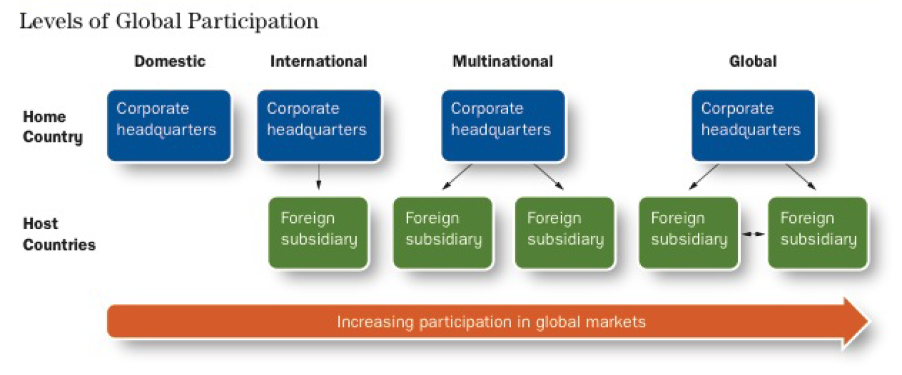

# International HR

## HRM in a Global Environment

HRM functions needs to adjust themselves as companies expand to operate in the global economy. Specifically, HRM has to:

* Align HRM processes with global requirements
* Adopt a global mindset
* Enhance its own capabilities to be an adequate business partner in acting on global business opportunities

### Global Expansion Trend

* Foreign countries provide businesses with new markets
* Operate with lower labour costs; e.g. with ==job outsourcing==

### Employees in an International Workforce

* **Home country**: The country in which an organization's headquarters is located
* **Host country**: A country (other than the home country) in which the organization hosts a facility
* **Third country**: A country that is neither the home country or a host country
* **Expatriates**: An employee who takes assignments overseas

### Levels of Global Participation

* Organizations begin by serving customers in the *domestic* marketplace
* Companies enter foreign markets as they see demand from customers from other countries
* They become *international* when they set up one facility overseas
* They become *multinational* when they set up ==multiple== facilities
* They become *global* when they start using global cultural differences as a competitive advantage rather than a challenge

## Factors Affecting HRM in International Markets

### Culture

* Most important for HRM
  * Often determines the other three influences
    * Laws often based on what a culture perceives as "right" or "wrong"
    * Influences what people value -> economic system and investment efforts
  * Determines effectiveness of various HRM practices

**Hofstede's Framework for Assessing Cultures**

* *Individualism/collectivism*: Strength of relationship between individual and other individuals within the society.
* *Power distance*: How the culture deals with unequal distribution of power and defines a "normal" level of inequality.
  * Small power distance -> attempt to eliminate inequality
* *Uncertainty avoidance*: How cultures handle unpredictable situations.
  * High uncertainty avoidance -> preference for structured situations
* *Masculinity/femininity*: Emphasis on traditionally masculine or feminine practices.
  * ==Masculine== culture emphasizes achievement/money-making/assertiveness/competition.
  * ==Feminine== culture emphasizes relationships/service/care for the weak.
* *Long-term/short-term orientation*: Whether focus of cultural values is on the future or the past/present.
  * Long-term orientation -> emphasis on saving and persistence
  * Short-term orientation -> promote respect for past traditions and for fulfilling social obligations
* *Indulgent/restraint*: Whether the cultures encourages satisfying gratification of human drives (i.e. is it fun?)
  * Indulgent -> encourage having fun
  * Restraint -> impose strict social norms

Compensation differs between individualistic and collectivist cultures.

* Performance-based rewards may be seen as more appropriate for individualistic cultures
* Collectivist cultures would have a "flatter" pay structure

### Education and Skill Levels

* Education and skill levels vary for each country
* Higher income countries generally have greater educational spendings
* Companies look for countries whose labour markets allow them to find suitable employees
  * Low education counries -> low skill, low wage jobs
  * High pool of trained workers -> high skill jobs

### Economic System

* Affects recruiting
* Different countries have different pay structures
* Generally, *socialist* countries have higher tax rates
* Companies paying two individuals the same rate may result in one individual taking home less than another

### Political-Legal System

* Host country laws directly impacts various HR requirements
  * Compensation has to abide by minimum-wage laws
  * Selection may be impacted by diversity laws
  * Other laws like maximum work hour time, vacation pay, time off etc.

## Workplace Planning

Workplace planning in the global economy revolves around deciding where and how many employees are needed for each international facility.

* Main consideration is *cost* and *availability* of qualified workers
  * With high numbers of immigrants, even domestic firms must consider international factors
  * Places like China and India were popular because of low labour costs, but increasing demand has driven up labour prices
  * Outsourcing (contractors specifically) is more popular
  * Country laws
    * Canada allows freedom for employer to hire for peak needs
    * Other countries, such as European countries, have stricter restrictions

## Selecting Employees in a Global Market

Organizations can fill foreign positions with either *home-country* nationals, *host-country* nationals or *third-country* nationals.

* Host country nationals
  * Understand values and culture of local workforce
  * Cheaper
  * May not be as qualified
* Home country nationals
  * Expensive
    * Sometimes have to transport families
    * Requires additional training
  * Families may not be permitted by host-country
  * Technical skills may outweigh cons
* Third country nationals
  * Broad experience
  * International outlook
  * Multilingual
  * May not have cultural fit

Nevertheless successful candidates should abide by the following critera:

* Competency in employee's area of expertise
* Ability to communicate verbally and nonverbally in foreign country
* Flexible, tolerant, and sensitive to cultural differences
* Suppport from family

### Foreign Assignment

Employees who undertake foreign assignment go through phases.

* *Honeymoon*: Euphoria/excitement as employee experiences new culture
* *Culture shock*: Discomfort with realization on cultural differences
* *Recovery*: Understanding of cultural differences
* *Adjustment*: Return to comfort as adjustment to cultural differences

Generally organizations find it difficult to convince employees to take on a foreign assignment.

* Some organizations compromise with *virtual expatriats*: people who manage foreign operations without relocating

## Training and Developing a Global Workforce

* Training and development programs should be effective for all participating employees
* Employer needs to provide training to aid in adapting to cultural differences in host countries

Training to prepare an individual for a foreign assignment is called **cross-cultural preparation**.

* Training is necessary for all three phases
  * *Departure*: Language instruction and orientation on host country culture
  * *Assignment*: Combination and formal program to ensure easy adaptation
  * *Return*: Updates on home country workplace

:::tip
Cross cultural training may be necessary for foreign workers coming into Canada as well.
:::

## Compensating an International Workforce

### Pay Structure

* Different countries provide different pay structure norms
* Companies face a dilemma between choosing how much to pay expats
  * Higher pay than local average may suggest unfairness for others
  * Same pay as local average makes it difficult to persuade employees to do foreign assignments
* Laws may enforce specific types of compensation like meal allowances or holiday bonuses
  
### Incentive Pay

* Incentive pay is treated different in different countries
* Employers may add incentives for working in high-risk areas
  * Direct compensation -> simply award pay bonus
  * Other measures -> security and latest information

## Selecting Expats

A successful expat has high *cross-cultural competence* and must be able to adequately adapt.

* Ability to maintain a positive self image and feeling of well being
* Ability to foster relationships with host country individuals
* Ability to perceive and evaluate the host country's environment accurately

## Preparing Expats

### Training

Employees preparing for foreign assignments require various types of information.

* *Cross-cultural training*
  * Develop awareness of host country culture
  * Information on appropriate behaviour in a business setting
* *Practical matters*
  * Housing, schools, recreation, etc.
* *Career development*
  * How assignment aligns with career goals
  * Potential assignments on return

Preparation process should continue after departure, e.g. with coaches/mentors, to aid when challenges arise.

### Compensation

Organizations use **balance sheet approach** -> adjust compensation to match home standard of living plus compensation for any hardships.

Total compensation package typically consist of four components:

* *Base pay*: Typically in line with home country standard
* *Tax equalization allowance*: Bonuses to compensate for differences in taxation rates
* *Benefits and services*: Cover added costs such as health, education, moving, storage, housing, etc.
* *Incentives*: Any additional compensation to make the foreign assignment more attractive for the employee

### Helping Expats Return

**Repatriation**: Process of preparing expatriates to return home from a foreign assignment.

* Main issues with reentry:
  * *Reverse* culture shock
  * Decline in standard of living
* Expats more likely to stay with companies that allows them to use their international experience

## Competitive Advantage

The workforce should be a core part of a company's *competitive advantage* (CA).

* Basic conditions for a CA
  * Difficult for competitors to imitate
  * ==Valued== in marketplace
  * Ideally sustainable
* Three classifications for CA
  * *Position*
    * Market-based, acquired by [first-movers](../../comm-296/05-product-strategy/README.md#diffusion-of-innovation)
  * *Resources*
    * [Brand value](../../comm-296/05-product-strategy/README.md#brand-value) -> Gucci
    * Patents -> Intel
  * *Capabilities*
    * Dynamic -> generation of new resources/positions
    * Typically related to intangibles
    * Examples
      * Apple -> Innovative design
      * Toyota -> Car development takes 3 years vs 5 years
