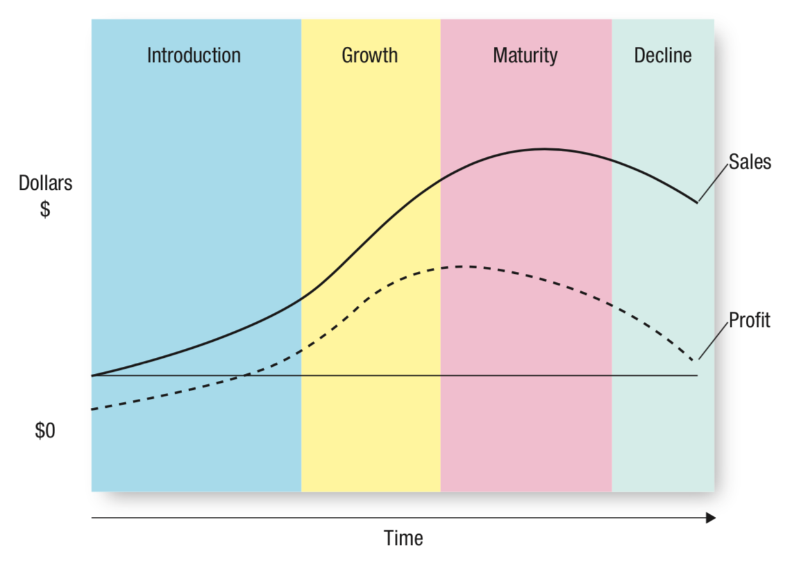

# Product Strategy

## Products and Product Types

### Product Components

A **product** is anything that might satisfy a *want* or *need*. A product has three major components:

1. *Core customer value*: The basic problem-solving benefits that customers are seeking.
2. *Actual product*: The core customer value gets turned into an actual product, which involve the physical attributes such as branding, packaging, features, etc.
3. *Associated services*: Any **non-physical** additions to the product, such as warranties, financing, product support, etc.

### Product Types

There are four main types of *consumer* products:

1. *Specialty*: All products for which customers will expend considerable effort to get.
     * For mountain bike enthusiasts, specialty products would be mountain bikes.
     * Luxury goods such as high-end cars or apparel also fit here.
2. *Shopping*: All products for which customers will spend considerable effort *comparing alternatives*; they will go "from shop to shop" to find the best possible product.
     * Things like furniture, apparel, etc.
3. *Convenience*: Products that customers spend little time thinking about.
     * Common household commodities like dish soap, tissues, etc.
4. *Unsought*: Products that customers do not know about.
     * Any "new-to-the-world" goods, such as new tech.

## Product Mix

A company's **product mix** is the complete set of all of their products and services.

A product mix typically consist of several **product lines**, which are groups of associated products that are typically used together or customers group together.

* The *breadth* of a product mix is the number of *product lines*.
* The *depth* of a product mix is the number of products *within* a product line.

### Product Mix Decisions

* **Increase depth**: Adding items to a product line
  * Address changing consumer preferences or preempt competitors
* **Decrease depth**: Removing items from a product line
  * Eliminate unprofitable and low margin products
  * Refocus marketing efforts to other higher priority products
* **Increase breadth**: Add new product lines
  * Capture new or evolving markets
* **Decrease breadth**: Remove product lines
  * Address changing market conditions or meet internal strategic goals

Increasing depth is also referred as *line extensions* while increasing breadth is also known as *brand extensions*.

---

**Line extensions**

* Pros
  * Finer segmentation can meet consumer needs better
  * Lower introduction costs
* Cons
  * *Cannibalization*: Reduction in sales of one product as a result of the introduction of a new product
  * Incresaed production cost and complexity

---

**Brand Extensions**

* Pros
  * Avoid cost of new brand development
  * More efficient promotion
* Cons
  * Credibility
  * Dilution of parent brand

## Services

The marketing of services differs from product marketing because of four fundamental differences in services.

### Intangible

Services are intangible. This intangibility provides some difficulty when it comes to marketing services:

* Difficult to convey the benefits
  * Offer "cues" to help customers perceive and experience their services in a more positive manner
* Difficult to promote
  * Marketers must creatively employ symbols or pictures to make their service seem more tangible

### Inseparable

Services are produced and consumed *at the same time*. This means that service consumption and production are inseparable.

* Customers are not able to "try" the service before they purchase it
  * When having a haircut, it's not possible to test whether the haircut will work out without actually doing it
  * Service firms sometimes provide extended warranties and 100% satisfaction guarantees to counteract this inseparability

### Heterogenous

Services are more likely to have variability or *heterogeneity* when it comes to the service's quality.

* Inferior products can be recalled and replaced; the same cannot be done for inferior services
  * Marketers can use the variable nature of a service to their advantage by customising the service to the customers' needs *exactly*
  * Alternatively humans are replaced with machines to counteract the variability
    * Using an ATM machine is more convenient and less variable than going to a bank teller

### Perishable

Services are *perishable* because they cannot be stored for later consumption.

* Perishability makes it difficult for marketers to match the demand and supply of the service
  * Marketers can use this opportunity by e.g. lowering prices during lower-demand intervals

## Growth Strategies

### Market Penetration

Employs the existing marketing mix and focuses the firm's efforts on existing customers.

* Primary goals
  * *Steal market share*: Attract new customers from currently targeted segment
  * *Intensify consumption*: Encourage existing customers to buy more or more frequently
* Requires greater marketing efforts
  * Increased advertising
  * Additional sales and promotions
* Intensified distribution efforts

### Market Development

Employs the existing market offering to *new* markets.

* International expansion is risky because firms must deal with differences in government regulations, cultural traditions, supply chains, and language.
* US firms may see a competitive advantage because US culture is widely emulated for consumer products.

### Diversification

Offer a *new* product to a *new* target segment. Diversification can either be *related* or *unrelated*.

* Related diversification
  * The new market shares something in common with the current market
    * Firms can reuse distribution channels/information systems
    * Can purchase from same vendors
* Unrelated diversification
  * New market has no relation to current market
  * **Highest risk** because of difference from core business

## New Product Development

A growth strategy whereby firms introduce a *new* product to the *current* target segment.

* *Innovation*: Process of transforming ideas into new products
* *Diffusion* of innovation: Process by which new products *spread* throughout a market group

### Why do Firms Innovate?

1. *Changing customer needs*
   * Firms can better create and deliver value by keeping up with changing consumer needs
   * New products can also reduce the possibility of consumers being "bored" of the current product
2. *Market saturation*
   * The longer a product is in the market, the more likely that market is going to be saturated
3. *Risk management*
   * Innovation allows firms to expand their product portfolio
   * Having a diverse portfolio reduces risk as some products may do well when others are doing poorly
4. *Fashion cycles*
   * In industries that face short product lifecycles, firms must repeatedly release new "versions" so consumers are satisfied
5. *Improving business relationships*

### Diffusion of Innovation

**Pioneers** are new-to-the-world products that either establishes new markets or drastically changes the "rules" of current markets.

:::tip Market rules
"Rules" refer to rules of competition and consumer preferences.
:::

* Pioneers are *first movers*
  * As the first to create a market, they are easily recognizable by consumers and establish an early market share lead

Pioneers often fail because:

* Competitors capitalize on their faults
* May have relatively high price points
* May have poor or unoptimal design

### Types of Users

The diffusion of innovation curve (above) shows that the spread of a new product generally follows a bell-shaped curve.

* *Innovators*: Buyers who want to be the first to have the new product or service.
* *Early adopters*: Buyers who are interested in new products but don't wish to take as mush risk as innovators. Usually wait to purchase the product after *careful review*.
* *Early majority*: New products are generally not profitable until this group starts purchasing them. Number of competitors also reached its peak.
* *Late majority*: The product has reached peak market potential. Sales usually level off or start to decline.
* *Laggards*: This group likes to avoid change and tend to rely on traditional products until they are no longer available.

### Rate of Adoption

Firms can predict which type of consumers will purchase their new product and adjust their marketing strategies accordingly.

The rate of adoption refers to the speed at which products diffuse throughout a market. Several factors affect the *rate of adoption* for a product.

* *Relative advantage*: If a product is better than its substitutes, then diffusion will be quick.
* *Compatibility*: Is it easy for consumers to make the substitution? This depends on different consumer preferences.
* *Observability*: Are the benefits or uses of the product easily communicated or shown to others? The easier it is, the faster the diffusion.
* *Complexity and trialability*: Simpler products that are relatively easy to "test" will have greater and faster adoption.

## Product Life Cycle

A product has four phases in its life cycle: introduction, growth, maturity, and decline.

### Introduction

The start of a new product or service, typically starts with a single firm.

* Other firms enter with similar or improved products at lower prices
* Characterized by initial losses due to high start-up costs and relatively low sales revenue

### Growth

Characterized by growing number of product adopters, rapid growth in industry sales and increase in number of competitors.

* Market becomes segmented and consumer preferences increasingly vary
* Firms attempt to capitalize on segmented market and establish their brand in order to not be outdone by competitors
* Firms typically see growing profits because of economies of scale in manufacture
* Some firms exit when they are not able to establish their brand in what is known as an *industry shakeout*

### Maturity

Characterized by the adoption of the late majority group and intense competition.

* Firms see increasing costs as they attempt to defend against fierce competition
* High competition also means prices are generally lower
* Firms see their profits level off or decline because of increasing marketing costs and lower prices
* Market becomes saturated as all or most of potential customers have adopted product

In this phase firms usually attempt to revitalize their product using two strategies: *entry into new markets* or *develop new products*.

---

**Entry into new markets**

* Attempt to enter new, possibly unsaturated, markets
* Find new market *segments* in current market
  * e.g. reduce prices

---

**Development of new products**

* Continually innovate to battle competition
* Introduce new products in an attempt to grow market share

### Decline

When a firm's product is in the decline phase, they have two options: *exit* or *niche*.

* Laggards enter the market
* Could adjust product to satisfy a niche market
* Otherwise slowly drop support for product

## Branding

### Brand Value

Brands add value for both consumers and sellers.

* **Brands facilitate purchases**
  * Easily recognizable so helps consumers make quick decisions
  * Consumers recognize offering before they see anything about the product itself; already possess a perception on quality and value
* **Brands establish loyalty**
  * Consumers learn to trust certain brands and have a strong affinity to them
  * Consumers will choose the brand's offerings over others
* **Protect from competition and price competition**
  * Competitive pressures less threatening because of consumer loyalty
* **Brands are assets**
  * A form of ownership; part of company's value

### Brand Equity

Refers to the set of assets and liabilities linked to a brand that add to or subtract from the value provided by the product or service.

The level of brand equity is measured through four aspects:

* **Brand awareness**: How many consumers know about the brand what it stands for?
  * Greater brand awareness allows for faster decision making
  * If the consumer is aware of the brand, it probably has valuable attributes
  * Brand awareness is created through *repeated exposure of brand elements*
* **Perceived value**: Relationship of product benefits to cost
  * Usually compared against competitors
* **Brand associations**: Mental links between a brand and its key product attributes
  * Often a product of advertising and promotional efforts
* **Brand loyalty**: Occurs through repeated purchases of product
  * Reward loyal customers with loyalty program
  * Low marketing cost to reach loyal customers
  * Loyal customers tend to spread positive word of mouth
  * Insulates from competition

### Branding Strategies

* **Brand ownership**
  * *Manufacturer brands*
    * Owned and managed by manufacturer
    * Manufacturer manufactures and maintains product quality
    * Majority of marketed brands are manufacturer brands
  * *Retailer/store brands*
    * Also called "private label brands"
    * Developed by retailers
    * Develop design/specifications for store brands to be produced by manufacturer
    * May develop special version of standard merchandise to be sold specifically at that retailer
* **Naming brands and product lines**
  * Brand should correspond to single market segment or need
  * *Family brands*
    * All products are sold under one brand
    * Individual brands can benefit from brand awareness associated with family brand
  * *Individual brands*
    * Maintain individual identities
    * Keep family separate from individual products
* **Co-branding**
  * Marketing two or more brands together on the same package/promotion/store
  * Enhance perception of product quality by linking an unknown brand to a well-known brand
* **Brand licensing**
  * Contractual arrangement when a firm allows another firm to use their brand name
  * Common in toys, apparel, accessories and entertainment products
  * Effective in attracting visibility through a well-known brand
  * Risky for licensor as brand image may be diluted if used inappropriately
* **Brand repositioning**
  * Change a brand's focus to target new market or realign brand emphasis with new market preferences
  * Usually high costs
  * Costs may not be recovered if not fit with consumers

## Packaging

The primary goal of packaging is to *attract the consumers' attention*.

* **Primary package**: What the consumers use
  * Seek convenience in terms of storage, use, and consumption
* **Secondary package**: Wrapper or exterior cotton that *contains* the primary package

### Role of Packaging

* For *manufacturers*
  * As a vehicle for branding
  * Allows same product to target different segments based on package size
* For *retailers*
  * To be functional; shelf, storage, prevents damage
* For *consumers*
  * Package represents brand's identity
  * Portrays quality and signals price
  * Enhances convenience

### Sustainable Packaging

* Recent development where firms attempt to provide more eco-friendly solutions to packaging
* Examples include *returnable packaging*, use of 3D printing, and *flexible packaging*