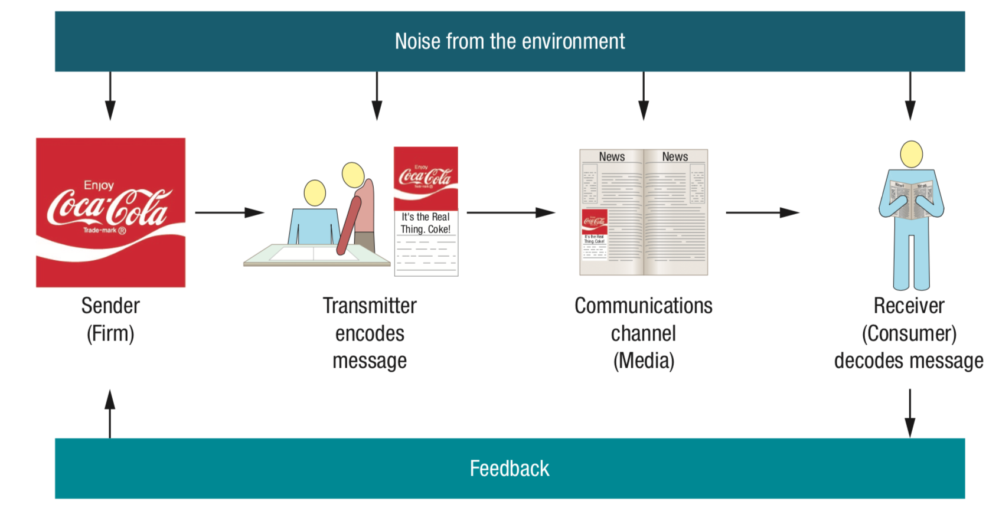

# Promotion Strategy

**Integrated marketing communications** -> promotion strategy aimed to reach target audience with the desired message.

Consists of three elements: **consumer**, **communication channels**, and **evaluation of communication results**.

## Communicating with Consumers

### Communication Process

A model that describes how communicates go from a firm to their consumers.

* **Sender** -> Message originator, must be clearly identified to audiences.
* **Transmitter** -> A creative department that receives and ==transforms== information.
  * Encoding -> Convert ideas into a message. Emphasis on what the consumer *receives* rather than what is *sent*.
* **Communication channel** -> The medium that carries the message.
* **Receiver** -> The person who reads/hears/sees and processes the information contained in the message.
  * Decoding -> Process by which the receiver interpets the message.
* **Noise** -> Any interference that conflicts with the intended message
  * Conflicting messages
  * Lack of message clarity
  * Flaw in communication medium
* **Feedback** -> Allows the receiver to communicate with the sender to ensure whether the message was received and decoded correctly

### How Consumers Perceive Communication

* Receivers decode messages differently -> Each receiver decodes the message in their own way and is often not in the way the sender intended
* Senders adjust messages based on the medium and the receiver's traits

## AIDA Model

Marketing communications intend to move consumers through a series of *mental stages*. The ==AIDA== model is the most popular model to describe these stages.

**AIDA model**: Awareness -> Interest -> Desire -> Action

### Awareness

**Brand awareness** refers to a potential customer's ability to recognize the brand and their associated products.

* Aided recall -> When consumers indicate they know the brand when the name is presented to them
* Top-of-mind awareness -> When consumers specifically ask for a brand when purchasing a product

### Interest

Communication must work to increase the interest level of the potential customers.

* Consumers must be **persuaded** that it is a product worth investigating.

### Desire

Once the firm has piqued interest in the target market, subsequent messages should attempt to move customers from *"I like it"* to *"I want it"*.

### Action

Goal of communications -> Drive consumer to **action**.

* **Lagged effect** -> A delayed response to a marketing communications campaign.
  * Typically takes several ad exposures before consumers fully process the message
  * Makes it difficult to measure the effectiveness of a campaign

## Promotional Mix

* **Advertising** -> Placement of announcements and persuasive messages
  * Typically requires little action from consumers
* **Public Relations** -> Management of communications to achieve a variety of objectives including: 
  * Maintaining a positive image
  * Maintain positive relationship with media
  * Handling of unfavorable events
* **Sales promotions** -> Special incentives or excitement-building programs that encourage customers to purchase a product
  * Coupons, rebates, contests, free samples, point-of-purchase displays
* **Personal selling** -> Two-flow communication between a seller and buyer with the intention of persuading the buyer to purchase the product
* **Direct marketing** -> Direct interaction with customers with the intention of generating a response or transaction

### Advertising

**Identify target audience**

Can be determining factor in deciding if an advertisement campaign is successful or not.

* Should keep in mind that the target audience may or may not be the current users of the product.

**Advertising strategies**

* *Push* strategy -> Increase demand by focusing on ==wholesalers, retailers, and salespeople==.
* *Pull* strategy -> Get consumers to ==pull== the product into the marketing channel by increasing the demand for it.

**Promotional objectives**

* **Informative** -> Create and build brand awareness.
  * Often useful for ==new products== or incoming ==sales events==.
* **Persuasive** -> Motivate consumers to take action.
  * Accelerate market's acceptance of product
  * Persuade customers to choose your brand over competitors
  * Common in **growth** and **early maturity** stages of product life cycle
  * May be used to **reposition** an established brand by changing consumer perceptions of the product
* **Reminder** -> Remind and prompt repurchases.
  * Common in maturity stage of product life cycle

**Focus of advertisements**

* Product-focused -> Aimed at raising awareness of a specific product or service
* Institutional -> Raise awareness of **issues** related to places, politics, or an industry
  * PSAs -> Focus on public welfare, typically sponsored by nonprofit institutions
  * Social marketing -> Application of marketing principles to a social issue

**Advertising budget**

Considerations when determining the advertising budget:

* Role advertising plays in meeting overall promotional objectives
* Varying advertising costs throughout product life cycle
* Nature of market and product
  * B2B advertising generally warrants lower costs than B2C

**Message**

* Determine the key message it wants to communicate
  * Communicate problem solving ability or **unique selling proposition** (what differentiates the product from competitors)
* Determine the **appeal** that would most effectively convey the message
  * **Information appeals** -> Appeal consumers by providing factual information
  * **Emotional appeals** -> Satisfy consumers' emotional desires

### Public Relations

PR activities often support other promotional efforts by generating free media attention and goodwill.

* Public sees media coverage generated by PR as more objective as it is not bought

* **Cause-related marketing** -> Promotion activity where businesses partner with charities to promote a product for their mutual benefit

**Key PR Activities**

* Publicity -> press releases, interviews, newsletters, etc.
* Sponsorship -> provide support (financially or otherwise) to various activities
* Corporate communications -> annual reports, corporate websites, etc.
* Special events -> open houses, public meetings
* Social media

