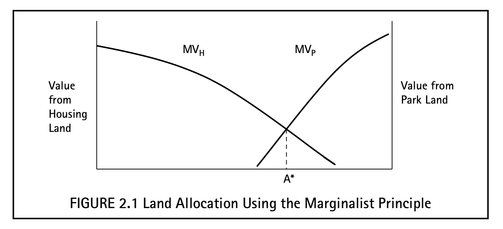

# Useful Economic Concepts

## Opportunity Cost

**Opportunity cost** -> Value of the best foregone alternative.

* A project should only be undertaken if its value exceeds its opportunity cost.
* Opportunity cost is seldom recognized.

## Marginalism

The marginal effect of any activity is the effect of doing that activity *a little bit* more.

* e.g. marginal revenue of selling a product is the revenue obtained from selling one more unit of that product.

Price reflects *marginal* value, not total value.

* Water is abundant and most people already have as much water as they would like
  * Consumers have less willingness to purchase a little more water
* Diamonds are scarce, so consumers are more willing to purchase one more diamond

**Marginalist principle** -> Any policy or activity should be carried out as long as its *marginal* benefit exceeds its *marginal* opportunity cost

* e.g. increasing education expenditures
  * Expenditure should keep increasing until marginal benefit = marginal cost
  * When MC > MB, increasing expenditure would only result in a net loss in value

Best way to allocate a scarce resource among two projects is to equalize marginal benefits:

Notes on the graph:

* X axis represents proportion of land use
* Y axis represents marginal value of land for that particular resource

This is the best allocation because:

* If $MV_H$ > $MV_P$, we would benefit by having more land for housing and less on parks
* If $MV_H$ < $MV_P$, we would benefit by having more land for parks and less on housing

Another way of looking at it is that the opportunity cost of housing is park land. Therefore $MV_P = MC_H$, and we should allocate more land to housing as long as marginal value exceeds marginal cost.

## Economic Incentives

==We expect people to follow economic incentives.==

* Policy changes that affect incentives typically have obvious outcomes
* Other times may induce unintended incentive effects
  * e.g. tax breaks for R&D programs led to companies rewriting regular expenses as R&D expenses
* Individuals and policy makers often fail to anticipate incentive effects

## Economic Efficiency

Different notions of efficiency:

* *Production* efficiency -> No inputs are wasted
* *Management* efficiency -> Cost is minimized (requires production efficiency)
* *Pareto* efficiency -> Resources are allocated in a way that it is impossible to make someone better off without making someone else worse off
