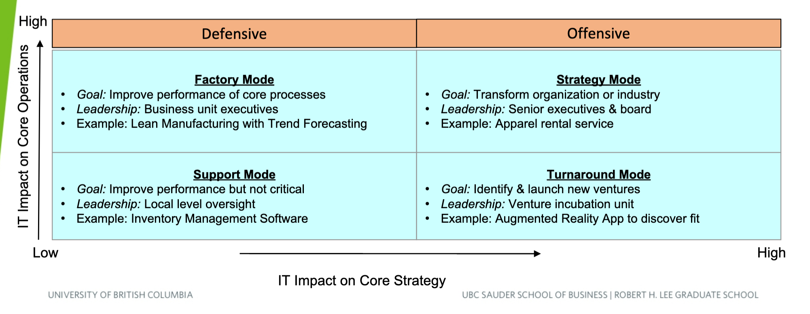

# Midterm Prep

## Lecture 1 - Introduction to IT

**Operational effectiveness** refers to performing a task *better* than others. *Strategy* refers to performing different tasks entirely, and is usually difficult to replicate.

* An effective strategy leads to a sustainable competitive advantage
* Requires understanding what *not* to do

IT can be used to improve the operational effectiveness of the current strategy, or can be used to create an entirely new business model altogether. Generally, IT provides either a supporting, facilitating, or enabling role.

* *Support*: Improve operational effectiveness
* *Facilitate*: Improve effective managerial decision making
* *Enable*: Allow for competitive advantage

## Lecture 2 - IT Strategy

As technology grows, technology that was once an enabler may become a facilitator. To continuously enable business strategy, a firm must continuously improve its IT.

IT frameworks can be used in 2 places:

1. Investigating what the firm does and look for ways IT can improve those processes
2. Investigating *where* the firm operates and looking for ways IT can help the firm overcome threats/take advantage of opportunities

### Value Chain

The value chain concerns with point 1. IT can improve the performance of the value chain through:

* Improving the performance of each activity
* Link activities together to address inefficiencies
* Facilitate support activities

### Porter's 5 Forces

IT can create threats and opportunities for each force:

* Competition
* Threat of new entry
* Buyer power
* Supplier power
* Threat of substitution

###  Paths to Market Leadership

There's 3 paths companies can take to be a market leader:

1. *Operational excellence*: Efficient supply chain management
2. *Consumer intimacy*: Scalability and reliability
3. *Product leadership*: Product quality and innovation

Regardless of the path they choose, IT can help facilitate them.

### IT Strategic Impact Grid

## Lecture 3 - Digital Transformation

In evolutionary biology, a stable environment leads to marginal improvements. A sudden change in the environment leads to mass extinctions but also an explosion of innovative adaptations which lead to new species. This is a good analogy for "digital transformation".

* **First wave**: Digitalization (1980s - 1990s)
	* Moving from mainframes to PCs
	* Advent of software applications
* **Second wave**: Internet (1990s - 2000s)
	* Early internet consisting mainly of static pages
	* Evolved to have more interactivity

There are talks on a potential incoming "tsunami" relating to cloud computing, internet of things, and artificial intelligence.

* **Artificial intelligence** refers to software that "learns" from data and improves its performance through learning.

## Lecture 4 - IT Service Management

IT service management refers to the process of creating and maintaining IT services in order to bring value to customers.

* Services refer to all the features, processes, competencies and skill sets you offer to your customers.

**ITIL** is a ITSM framework. It's one framework but is common in large companies.

* DevOps (Development/Operations) is an approach focused on the continuous improvement of existing services.

When thinking of providing a new service, always start at the **service strategy**.

* What are your business objectives?
* Why are you offering what you're offering?
* How will this service drive value?

**Service catalogue management** refers to your portfolio of offered services. Typically driven well in advance of service strategy.

**Service level management** refers to the processes done to create and maintain service level agreements.

* An SLA is a statement of commitment to the services that you provide and how you demonstrate accountability
* Incident management is typically included in an SLA

## Lecture 5 - Cybersecurity

Cybersecurity revolves around:

* *Confidentiality*: Data is only available to those who are authorized to access the data
* *Integrity*: Data is timely and correct
* *Availability*: Data is easily retrieved when it is required
* *Compliance*: There is proof that you do what you say you do

Since security risk is business risk, the Chief Information Security Officer (CISO) should report directly to board of directors.

Some examples of cybersecurity processes include:

* For employees
	* Onboarding orientation
	* Termination process
* Audit
	* Risk assessment
	* Logging
* Controls
	* Access/change controls
* Management
	* Vendor risk management
	* Incident response management
	* Vulnerability managem
