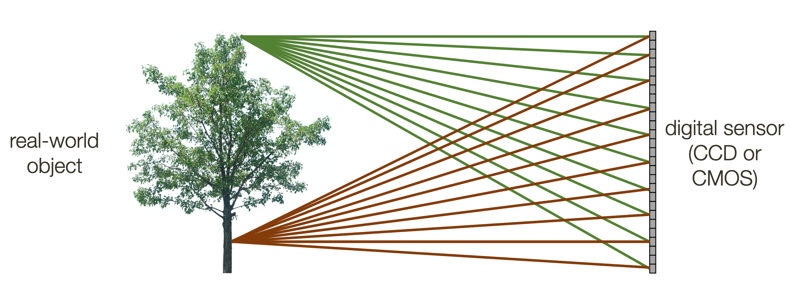
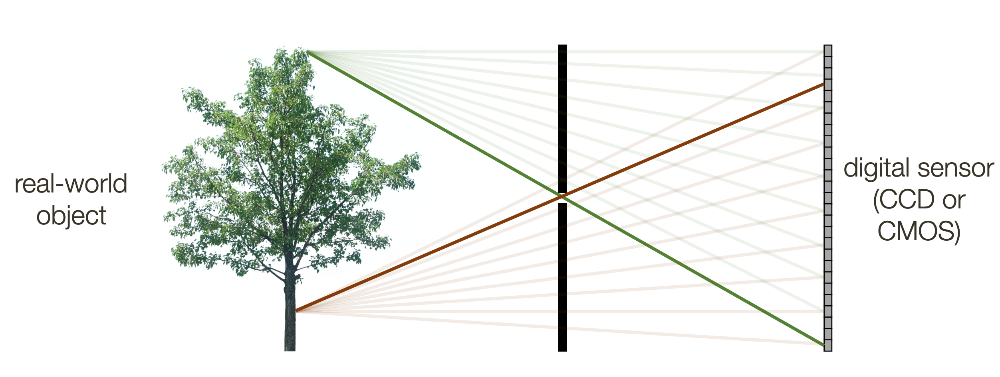
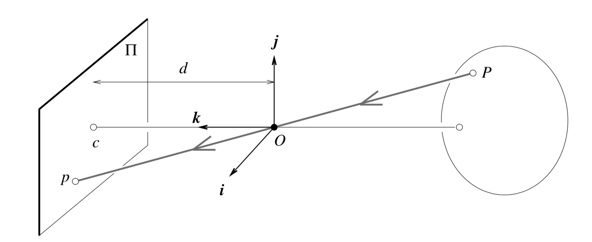
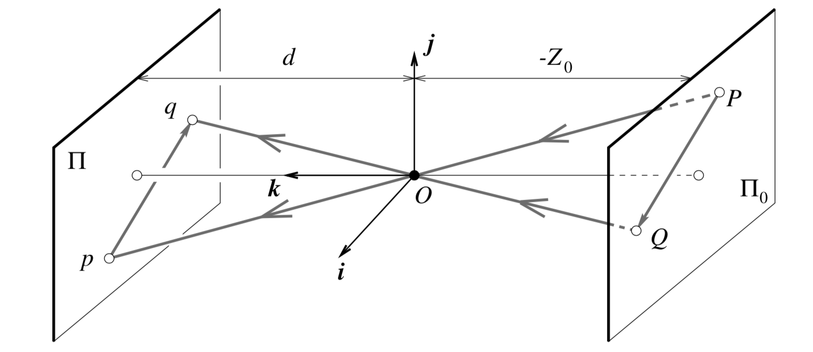
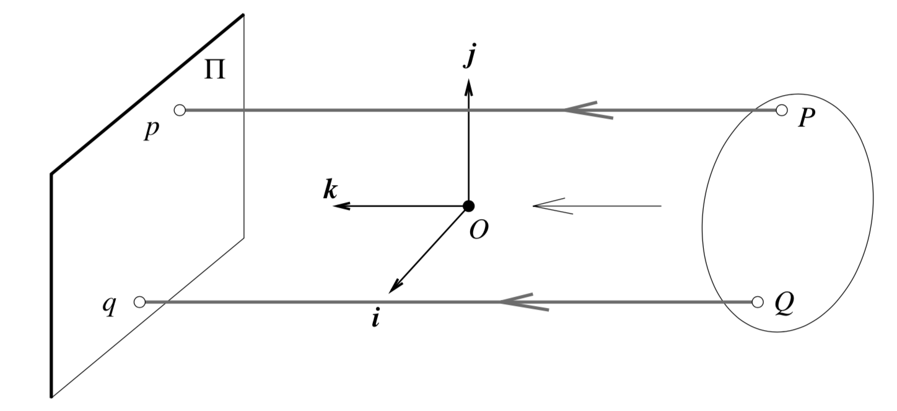
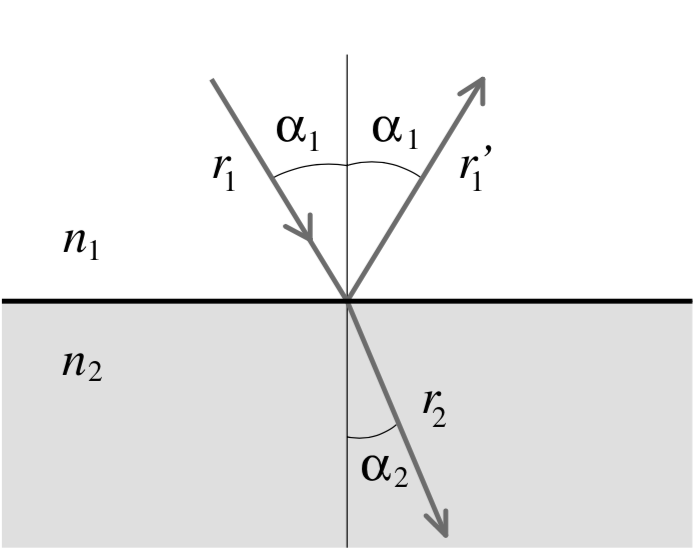
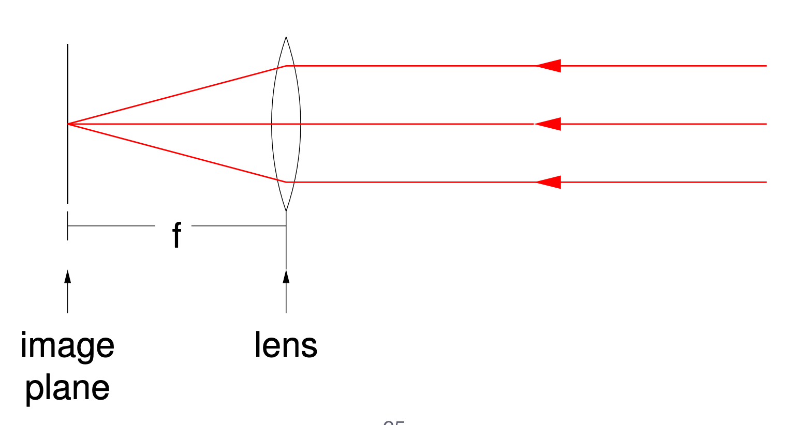

# Image Formation

When we are looking at a surface, our eyes are receiving the light that is *reflected* off that surface. If we have a *sensor* that can detect this light, we can *capture* this reflected light to generate an image.

Unfortunately, just pointing that sensor to an object won't result to a clear image. This is because each point in the sensor is capturing light from *all* parts of the object:

## Pinhole Camera

A **pinhole camera** avoids this problem by *limiting* the amount of light that is captured by the sensor:

* Because the **top** of the object is reflected at the **bottom** of the sensor, the image produced by the pinhole is inverted.

Through this pinhole model we observe a couple of things:

* Objects that are farther away appear smaller in the sensor.
* Parallel lines will appear to meet at a point, called the **vanishing point**.

## Geometric Interpretation

### Perspective Projection

Consider a three dimensional coordinate system centered at the pinhole $O$. Our sensor is positioned at a distance $d$ away from the pinhole, opposite to our scene:

A point $P = (X, Y, Z)$ on our subject projects to a point $p = (x, y)$ on our sensor, where:

$$x = d\frac{X}{Z}, \quad y = d\frac{Y}{Z}$$

### Weak Perspective

Weak perspective assumes the subject lies on a two-dimensional plane $\Pi_0$ positioned at a distance $-Z_0$ in front of the pinhole:

* The negative sign is in front of $Z_0$ because $d$ is non-negative

In this simpler model we can define the coordinates $(x, y)$ of our image as:

$$x = mX, \quad y = mY, \quad m = \frac{d}{Z_0}$$

### Orthographic Projection

When the subject is sufficiently far away enough from the pinhole, we can assume that the rays that are coming in are **parallel** to one another:

## Lenses

Since pinholes limit the amount of rays that come through, the image often ends up dark. **Lenses** aim to capture more light while preserving the focus possible by a pinhole.

When light passes *through* a medium, it is said to have **refracted**. Refraction is governed by Snell's law, which states that:

$$n_1\sin\alpha_1 = n_2\sin\alpha_2$$

Where:

* $n_1$ and $n_2$ are the indices of refraction of the two materials

### Focal Length

The focal length of a lens is the optimal distance behind the lens to put the sensor, assuming the incoming rays are parallel to one another:

* Placing the sensor either too close to the lens or too far from the lens will result in a blurry image.
