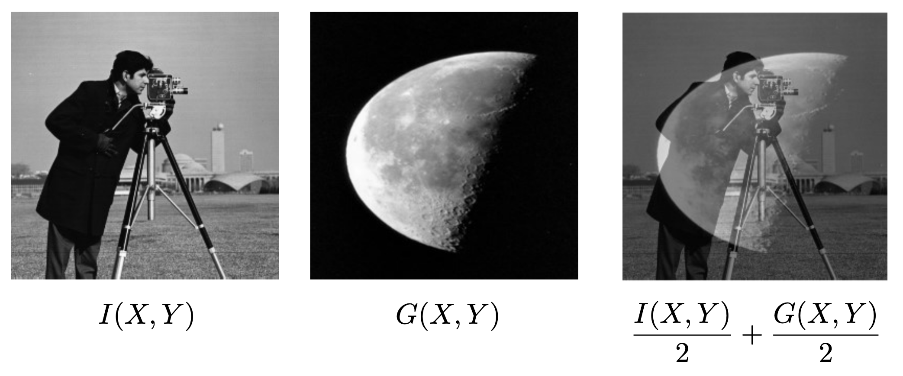
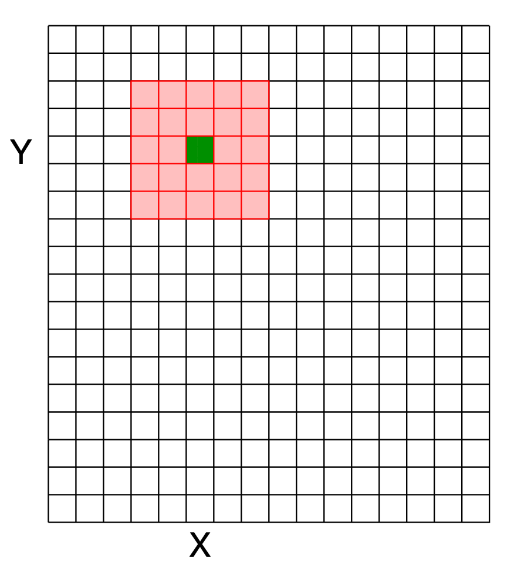
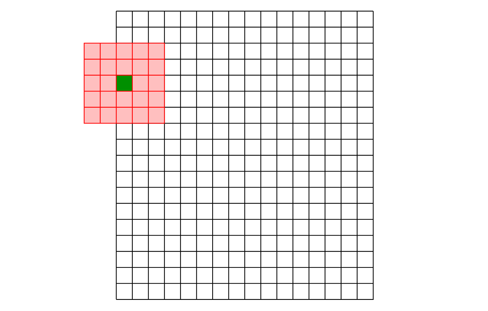

# Image Filtering

A (grayscale) image can be defined as a function $I(x, y)$, where $x$ and $y$ are the dimensions of the image.

* $I$ has range $[0, 255]$

Since images are functions, we can perform operations on them, e.g. averaging:

* Image **filtering** alters the *range* of the image function
* Image **warping** alters the *domain*

## Types of Filtering

* **Point operation** -> A function applied to *each* pixel
* **Neighbourhood operation** -> Each pixel depends on a combination of the old pixel *and its neighbours*

Filtering typically refers to neighbourhood operations.

## Correlation

* The function, $F(X, Y)$, that takes the original pixel and its neighbours and return a new pixel, is called the **filter** or **kernel**.

* The dark red pixel is the current pixel being worked on.
* The surrounding pixels are all of the pixels being considered by $F(X, Y)$.
* We say that the red square has dimensions $m\times m$.

Mathematically the new pixel $I'(X, Y)$ is defined as:

$$I'(X,Y) = \sum_{j=-k}^k\sum_{i=-k}^kF(I,J)I(X+i,Y+i)$$

* Where $k$ is the floor of $\frac{m}{2}$.

## Boundary Effects

What to do when calculating pixels at the borders of the picture, where $X+i$ or $Y+i$ may potentially be undefined?

1. **Ignore these locations** -> Make the computation undefined for the top and bottom $k$ rows and the leftmost and rightmost $k$ columns.
2. **Pad with zeroes** -> Whenever a value is required and it is undefined, use zero instead.
3. **Wrap around** -> Use the pixels on the opposite side instead.

