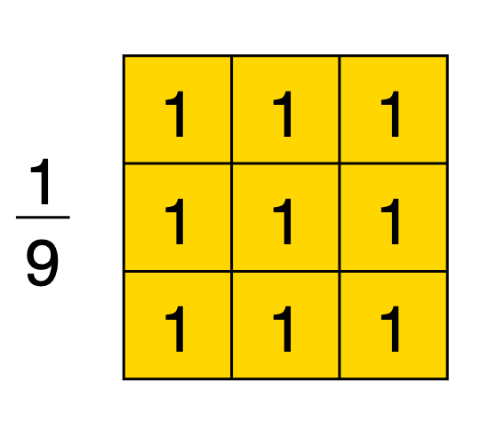
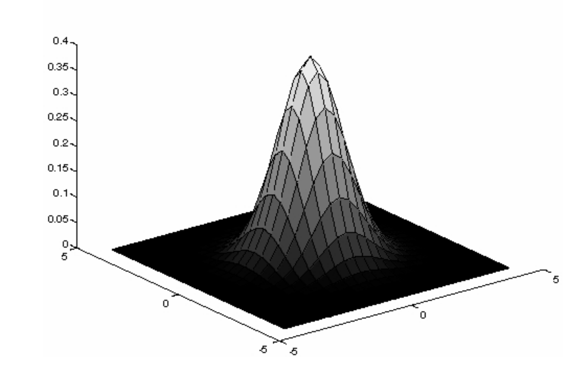
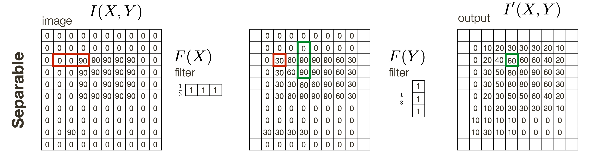
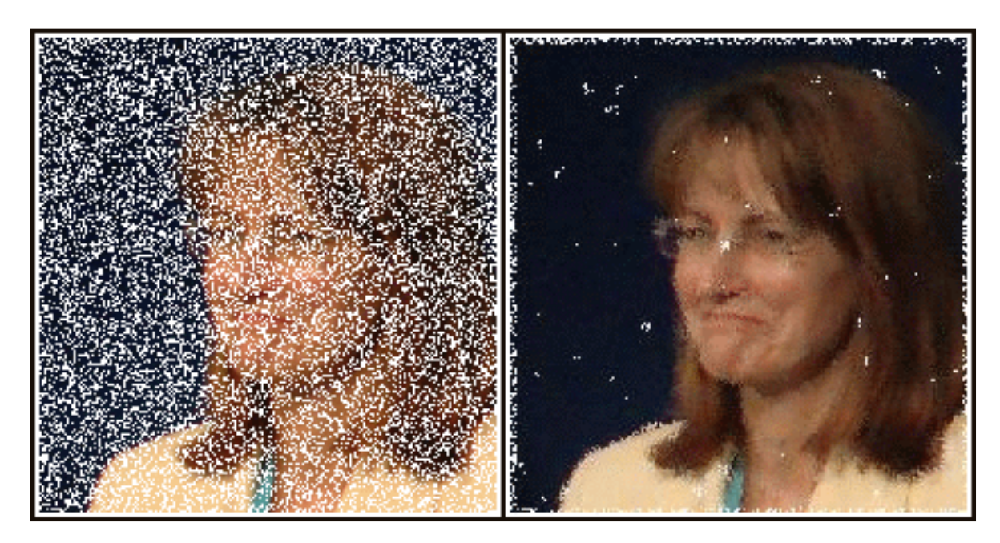

# Image Filtering

## Linear Filters

We can describe an image as a 2D function $I(X,Y)$ where $X$ and $Y$ are the dimensions of the image.

* For a grayscale image, $I \in [0, 255]$.

When we filter an image, we construct a new image where each pixel of the image is a linear combination of the old pixel and its neighbours.

* The weights for the combination is determined by an $m\times m$ filter or kernel.
* This kernel is centered at the pixel that is currently being inspected.

### Runtime

Mathematically, the formula for filtering an image is:

$$I'(X,Y) = \sum^k_{j=-k}\sum^k_{i=-k}F(i,j)I(X+i,Y+j)$$

Given a $m\times m$ filter, calculating the linear combination for one pixel requires $m^2$ operations. For an image that is $n\times n$, this is an $O(n^2m^2)$ operation.

* This becomes more problematic as $m$ approaches $n$.

### Boundary Effects

Sometimes a neighbouring pixel is undefined because it is out of the image boundaries. In this case, we have 3 options:

* Treat the calculation as undefined
* Replace the undefined value with a zero
* Treat the picture as periodic, i.e. take the corresponding pixel from the other side of the picture

### Correlation vs. Convolution

The above formula is also known as **correlation**. Convolution is an operation that is very similar:

$$I'(X,Y) = \sum^k_{j=-k}\sum^k_{i=-k}F(i,j)I(X-i,Y-j)$$

Visually, convolution can be interpreted as a correlation operation where the filter is flipped 180 degrees clockwise.

Convolution is useful because it is associative, i.e. if $*$ is a convolution operation, then $G * (H * I) = (G * H) * I$. This means that sequential filters can be convolved together first prior to performing it on an image.

## Smoothing

A use case for filters is to apply artifical lens blur.

### Box Filter

The box filter is the simplest filter to model lens blur:

It works by simply taking the average of a pixel and its neighbours.

* The example above is a $3\times 3$ filter.
* It is multiplied by $\frac19$ so that the *brightness* of the resulting image stays the same.

Unfortunately, box filters do not appropriately model lens defocus.

### Gaussian

The gaussian filter is an alternative filter to blur out an image. The main concept of a gaussian filter is that closer pixels should contribute more to the resulting pixel.

The 2D gaussian function is:

$$G_{\sigma}(x,y) = \frac{1}{2\pi\sigma^2}\exp(-\frac{x^2+y^2}{2\sigma^2})$$

* A larger $\sigma$ leads to higher weights placed on the *neighbours*, i.e. more blur.
* Subsequently a smaller $\sigma$ leads to higher weights placed on the *center pixel*, i.e. less blur.

A good gaussian filter should:

* Be normalized (sum up to 1)
* Capture $\pm3\sigma$ e.g. if $\sigma=1$, then the radius of the filter should be 3, giving a filter size of $7\times 7$

### Pillbox

The pillbox filter is essentially a box filter turned to a circle.

* Like a gaussian filter, the pillbox filter is rotationally invariant
* Unlike a gaussian filter, the pillbox filter is *not* separable

## Separability

A 2D function is separable if it can be defined as a product of two 1D functions, one a function of $x$ and the other a function of $y$.

* The box and gaussian filters are both separable

This allows for performance improvements because then the 2D filter can be implemented as two 1D convolutions.

* First convolve each *row* with $F(x)$
* Then convolve each *column* of the result with $F(y)$ (or vice versa)

Separability reduces the runtime of the convolution from $O(m^2n^2)$ to $O(2mn^2)$.

## Frequency

An image can be said as having a spatial frequency.

* High frequency images are images where close pixels are typically different from one another
* Low frequency images are images where neighbouring pixels are similar to one another

A filter is classified as a **low-pass** filter when it filters out high-frequency content of a picture. In other words, it makes neighbouring pixels more similar to one another.

## Non-Linear Filters

### Median Filter

The median filter takes the median value of the pixels under the filter.

* Forces "outliers" to be more like their neighbours
* Effective at removing noise known as *impulse* noise

### Bilateral Filter

The bilateral filter is a filter that works similarly to the gaussian filter, in that:

* Weights depend on spatial distance from the centre pixel
* Pixels that are closer should have greater influence than pixels that are far away

But unlike a gaussian filter:

* Weights also depend on the *range* distance, that is the numerical difference between the pixel value and the centre pixel value
* Pixels of a similar brightness should have greater influence over pixels of a dissimilar brightness

Since weights depend on both spatial distance and range, the formula is defined as the product of a *domain* kernel and a *range* kernel:

* The domain kernel remains constant throughout the entire image
	* Similar to a gaussian kernel
* The range kernel must be calculated for every pixel

The bilateral filter is effective at denoising images while maintaining edges (unlike the gaussian filter).

* Multiple iterations of the bilateral may lead to a cartooning effect.

