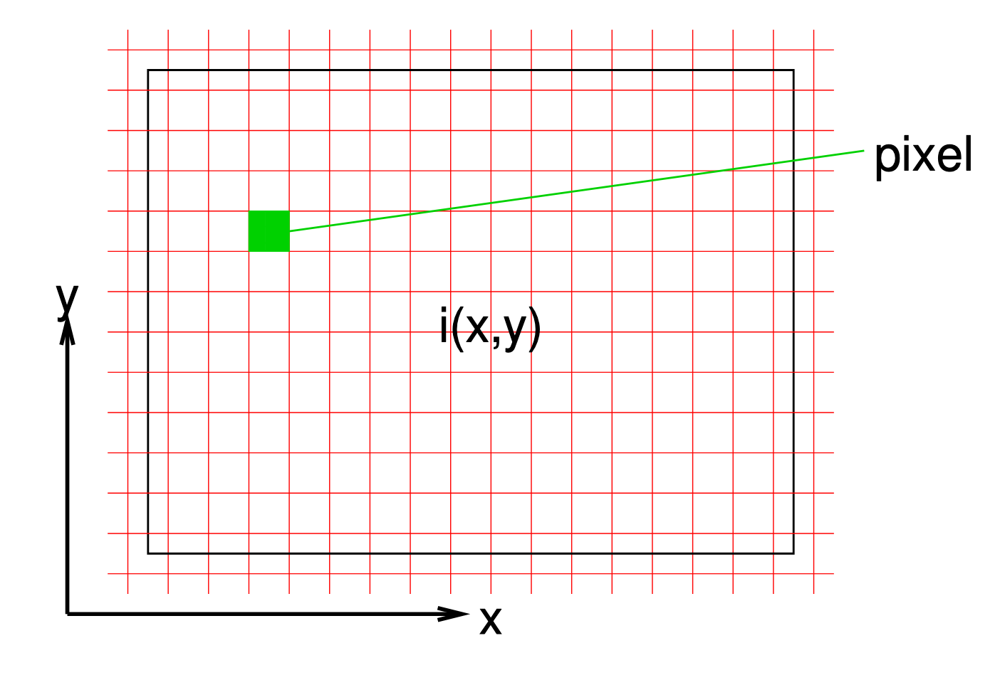
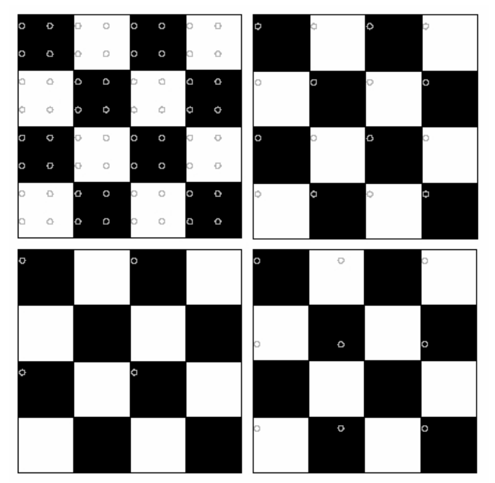
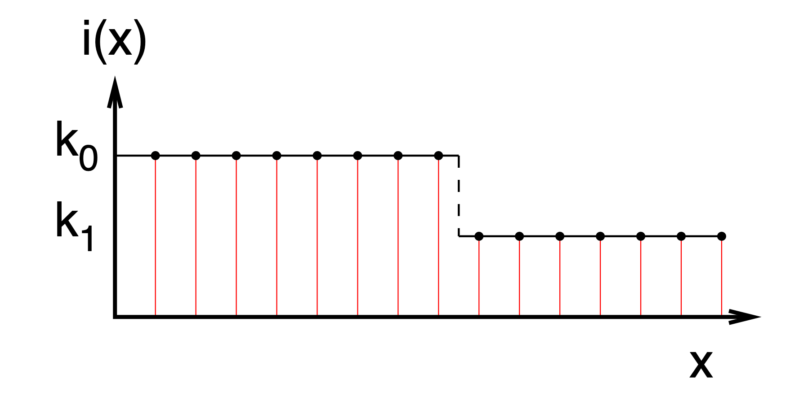
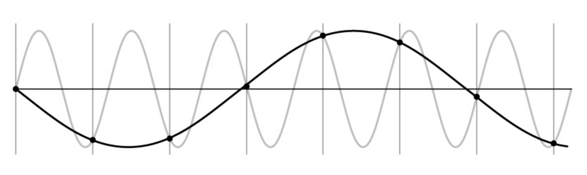

# Sampling

So far we have defined an image as a 2D array of pixels, where each pixel is in a range $[0,255]$. The indices $(x,y)$ of each pixel denotes the pixel's location within the image. However, light that is captured from a camera is *continuous* - pixels don't already exist. This leads us to the following problem: **How do we construct a pixel representation from continuous captured light**?

Define a *continuous* image, i.e. the light intensity captured, as $i(x,y)$ where $I(x,y)\in [0, M]$, where $M$ is some maximum intensity. Then, superimpose a grid on top of this image and set the pixel value by sampling each tile:

## Sampling Methods

### How to Sample?

We have two options to sample:

1. Sample a random point
2. Take the average brightness over the entire tile

Area-based sampling is more often used in practice, whereas point sampling is more useful in theory.

### What about Brightness?

We divide the range $[0,M]$ into a finite number of groups. The number of groups is dependent on the number of bits $n$ we have available to store each pixel.

* Typically $n=8$, so we have $M=2^8-1=255$.

## Reconstruction

### Information Loss

It's easy to choose a sampling method that would result in lost information:

The background image is the image received by the camera. The dots are the pixels that we choose to sample. The top 2 methods provide an accurate portrayal of the original image, but the bottom 2 methods would provide significantly different images.

Given the top 2 sampling methods, we can say that $I(X,Y)$ is an *exact characterization* of $i(x,y)$. In the general case, reconstruction often involves some form of interpolation.

### Interpolation

Reconstruction from the following sample is easy because samples are equidistant and lie on the same line:

On the other hand, (accurate) reconstruction from the following sample is *impossible* because of the discontinuity:

It is easy for us to *undersample*, interpreting a signal as one at a lower frequency. This effect is known as aliasing:

### Sampling Theory

If there is a maximum constraint to how much $i(x,y)$ can change, we can accurately reconstruct the original signal from a set of samples. This constraint is formally known as a **bandlimited signal**.

The **Sampling Theorem** states that if you sample at or above twice the maximum frequency, you can reconstruct the original image exactly from the samples.

Returning to the grid image from earlier:

The top right square is sampling at the *same* frequency of the original image, while the top left square is sampling at *double* the frequency. This leads to accurate results.