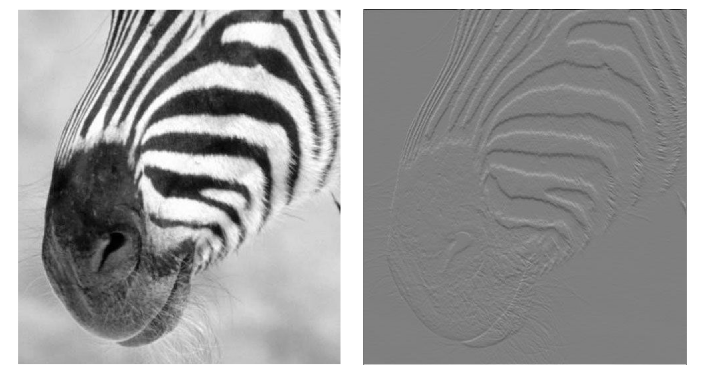
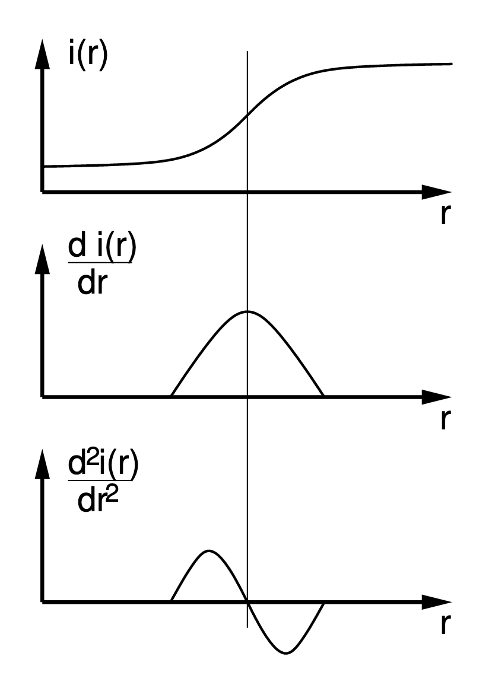
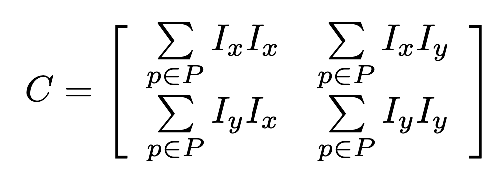

# Edges and Corners

## Templates

How can we find instances of a particular pattern in an image? We use that pattern as a *template*. Correlation/convolution can be viewed as a comparison between parts of an image and the filter (template).

* The correlation computes the dot product between the template and the part of the image.
* The dot product may be high simply because the part of the image is bright. This suggests some normalization has to be performed.

One way to normalize the result is to use the $\cos$ formula:

$$\cos\theta=\frac{a\cdot b}{|a||b|}$$

This results in a value that is between $-1$ and $1$, where $1$ suggests the particular part of the picture is perfectly identical. In this case $a$ is the image and $b$ is the template.

The norm of the image $|a|$ is not the sum of the entire picture, but rather just the sum of the image patch that is being analyzed by the template $b$. This can be computed by convolving a squared image with a filter of 1s (of size = template) then calculating the square root of the result.

Once we have a matrix of values between $-1$ and $1$, we use a threshold to determine if an area around a certain pixel matches our template.

### When Does it Fail?

Template matching is sensitive to various factors:

* Different scales
* Different orientation
* Lighting conditions
* Occlusions
* Different perspective
* Motion/blur

One way to make templates robust to size differences is to use **scaled representations**.

### Scaled Representations

We can build a scaled representation of the *image* to make template matching robust to size differences. An example of a scaled representation is a gaussian pyramid, where we make copies of progressively smaller images. Once we have these smaller images, we perform template matching on each image. If there is a match on *any* of the images, then we know the pattern exists in the image.

We create progressively smaller images rather than progressively larger templates for efficiency reasons. If our template has width $m$ and our image has width $n$ (assuming square images and templates), then the runtime for convolution is $O(n^2m^2)$. By using progressively smaller images, this runtime becomes an upper bound. Conversely, using larger templates makes this runtime a *lower* bound.

### Shrinking Images

Shrinking an image by taking every other pixel may lead to strange artifacts. A more accurate way to shrink images is to gaussian blur the image first *then* take out half the rows and columns.

* This works because by blurring the image, we are "bandlimiting" the image such that sampling half the pixels would lead to an accurate representation.
* Typically reducing the size by 0.5x requires a $\sigma = 1$

## Edge Detection

Unfortunately template matching is still sensitive to all factors other than the scale difference. A more effective method may be to find local *features*, e.g. edges and corners.

One way to find edges is to use derivatives. If the change from one area of the image to another is very drastic, then we can reasonably say that an edge exists there. This change can be modelled using derivatives.

The right picture depicts the derivative of the zebra in the $y$ direction. There are clear edges that form as a result of the zebra's stripes.

While derivatives are typically used in a continuous context, we can use a discrete approximation:

$$\frac{\partial f}{\partial x}\approx\frac{F(x+1,y)-F(x,y)}{\Delta x}$$

This translates to the 1-dimensional filter $[-1, 1]$. We can then use convolution to compute the X and Y derivatives of an image.

* The weights of a filter used for differentiation should sum to 0 because a constant image has a derivative of 0.

The combined X and Y derivatives is known as the gradient of the image. We can visualize this gradient using its magnitude.

### Edges

Four scene properties causes an edge to appear:

1. Depth discontinuity
2. Surface orientation discontinuity
3. Reflectance discontinuity (e.g. change of material)
4. Illumination discontinuity (e.g. shadows)

Regardless of cause, an edge is a location with a *high gradient*. To detect an edge, we can either use a local extrema of the first derivative, or a zero-crossing of the second derivative.

For the first method we provide a threshold and take all pixel values above that threshold. For the second method we take the pixel value where the zero crossing occur.

### Laplacian of Gaussian

The laplacian of gaussian is essentially the second derivative of the gaussian filter. It is an approach to the second method of edge detection.

* An easy way to compute the laplacian is to create a smooth variant of an image then subtracting the smoothed variant from the original image.

### Canny Edge Detector

The canny edge detector is an approach to the first method of edge detection. It works by first computing the image's gradient magnitude and direction, then:

* Performs *nonmaxium supression*: Keep only the peaks of the gradient and remove everything else.
* Linking and thresholding: Maintain two thresholds to determine if series of points should be considered an edge or not.
	* Everything above the *high* threshold is automatically kept, and everything below the *low* threshold is automatically removed.
	* Everything between the low and high thresholds will be kept only if it is connected to something that is above the high threshold.

## Harris Corner Detection

A corner is interesting because it is distinctive and can be *reliably localized*, that is we can reliably estimate the location of a corner.

* If we place a window over a *constant* part of an image, moving the window in any direction would not lead to any change in the image.
	* This implies that the gradient should remain constant over this window.
* If we place a window over an *edge*, moving the window in the direction of the edge would not lead to a meaningful difference.
	* This implies that the gradient will have a drastic change in only one direction.
* Conversely, placing a window over a *corner* would lead to meaningful changes when we move the window in *any* direction.
	* This implies that the gradient will have drastic changes in *all* directions.

Edge detectors perform poorly at corners because the value of the gradient is poorly defined at corners. The idea behind corner detection is to use a **window** and *compare* derivatives $I_x$ and $I_y$ within that window using a covariance matrix. 

We can then take the eigenvalues of this matrix to determine an appropriate "score". Generally if we find that:

* Both eigenvalues are large, then we have a corner
* Only one eigenvalue is large, then we have a corner for that axis
* Both eigenvalues are small, we have a flat area

We use these eigenvalues to compute a score. Harris uses the following formula:

$$R=\det(C)-k\text{trace}^2(C)$$

Where $\det(C)=\lambda_1\times\lambda_2$, and $\text{trace}(C)=\lambda_1+\lambda_2$. Then we set a threshold and treat all points above the threshold to be corners.

Note that the Harris corner detection method is:

* Invariant to rotations
* Partially invariant to shifts in intensity (requires change in threshold)
* Not invariant to changes in scale

