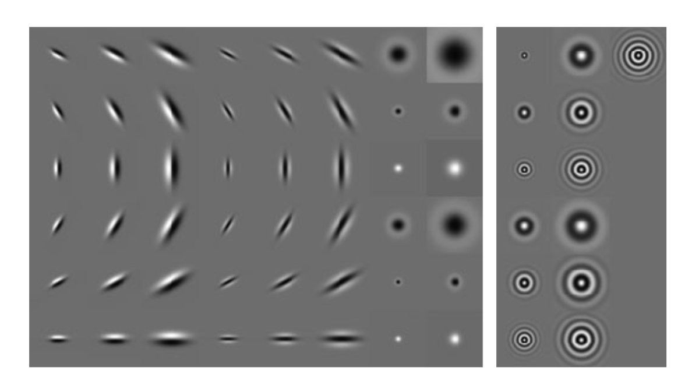

# Texture

Texture is a repeatable detail in an image that can be used to identify objects if the object has a known material. It can also be used to identify the shape of an object based on the deformation of the texture.

## Texture Representation

A texture is made up of a series of subelements, repeated over a particular *region* in a picture. We can find these subelements using filters, then represent each pixel with a summary of the subelements that surround that pixel.

### Spots and Bars

The most ideal choice of filter are some variant of spot filters and bar filters. This is because most textures are fundamentally made up of spots and bars. It would also be difficult to "break up" a spot or a bar to even smaller subelements.

