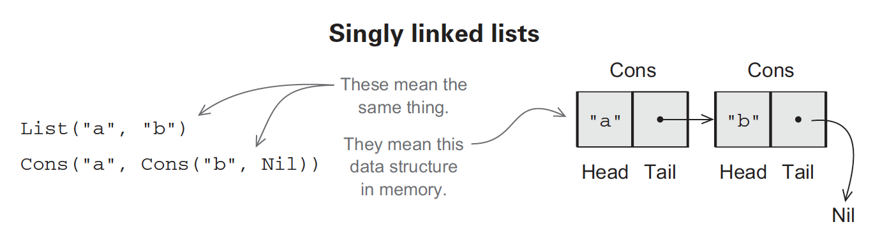

# Functional Data Structures

## Defining Functional Data Structures

A functional data structure is operated on using only **pure functions**.

> A pure function is a function that does not mutate data and performs no side effects.

Consider the following functional data structure, a singly linked list:

```scala
sealed trait List[+A]
case object Nil extends List[Nothing]
case class Cons[+A](head: A, tail: List[A]) extends List[A]

object List {
  def sum(ints: List[Int]): Int = ints match {
    case Nil => 0
    case Cons(x, xs) => x + sum(xs)
  }

  def product(ds: List[Double]): Double = ds match {
    case Nil => 1.0
    case Cons(0.0, _) => 0.0
    case Cons(x, xs) => x * product(xs)
  }

  def apply[A](as: A*): List[A] =
    if (as.isEmpty) Nil
    else Cons(as.head, apply(as.tail: _*))
}
```

* A `trait` is an abstract interface that may optionally contain implementations of some methods.
  * Here the trait `List` is defined, without any methods.
* The `sealed` keyword enforces that all implementations of the `trait` must be declared in this file.
* The lines that start with `case` are the two implementations or *data constructors* of `List`.
  * These implementations show the two forms `List` can take.
  * `Nil` represents an empty list.
  * `Cons` represents a nonempty list, which consists of a `head` and a (possibly empty) list `tail` of the remaining elements.



The type parameter `[+A]` declared after `List` indicates that `List` is polymorphic (similar to how functions can be polymorphic).

### Type Variance

The `+` declared before the `A` in `[+A]` indicates that A is *covariant*.

* This means that if `X` is a subtype of `Y`, then `List[X]` is a subtype of `List[Y]`.
* `Nothing` is a subtype of all types. This covariance allows us to write `List[Double]` and declare it to `Nil` with no problems.

### Variadic Functions

The `apply` function in `object List` is a *variadic* function as it accepts an arbitrary number of `A`s as its arguments.

* The `_*` part of the recursive call to `apply` returns the rest of the arguments.

:::tip Javascript translation
The same code in Javascript can be written as:

```js
function apply(...as) {
  if (as.length === 0) return []
  return [as[0], apply(as.slice(1))]
}
```
:::

### Companion Objects

A *companion object* is an object with the same name and data type as our declared data type (In the code snippet above, it is the `object List` declaration).

* The companion object contains various convenience functions for working with values of the data type.

## Pattern Matching

`sum` and `product` in the `List` object above makes use of *pattern matching*:

```scala
def sum(ints: List[Int]): Int = ints match {
  case Nil => 0
  case Cons(x, xs) => x + sum(xs)
}
```

Pattern matching is essentially a **more powerful switch statement**. The pattern in the match statement are more "flexible" than in switches:

```scala
List(1, 2, 3) match { case _ => 42 }
```

* Returns 42.
  * `_` is known as a *variable* pattern. Any variable (like `x` or `foo`) can be used here but it's convention to use `_`.

```scala
List(1, 2, 3) match { case Cons(h, _) => h }
```

* Returns 1.
  * This is because the `List` is basically `Cons(1, Cons(2, Cons(3, Nil)))`, so the `_` matches the tail portion of the first Cons.

```scala
List(1, 2, 3) match { case Nil => 42 }
```

* Results in a `MatchError` because none of the cases matched the target.
